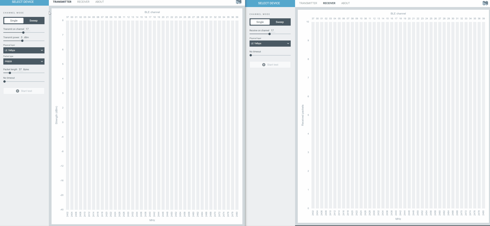

# nRF Connect Direct Test Mode

nRF Connect Direct Test Mode is an application for performing RF PHY testing of Bluetooth Low Energy devices with the Bluetooth-specified Direct Test Mode. See the [Bluetooth Core specification](https://www.bluetooth.com/specifications/specs/core-specification-5-3/) (volume 6, part F) for more information about the Direct Test Mode specification.

## Installation

nRF Connect Direct Test Mode is installed from nRF Connect from Desktop. For
detailed steps, see
[Installing nRF Connect for Desktop apps](https://docs.nordicsemi.com/bundle/nrf-connect-desktop/page/installing_apps.html)
in the nRF Connect from Desktop documentation.

## Documentation

Read the
[nRF Connect Direct Test Mode](https://docs.nordicsemi.com/bundle/nrf-connect-direct-test-mode/page/index.html)
official documentation.

## Development

See the
[app development](https://nordicsemiconductor.github.io/pc-nrfconnect-docs/)
pages for details on how to develop apps for the nRF Connect for Desktop
framework.

## Feedback

Please report issues on the [DevZone](https://devzone.nordicsemi.com) portal.

## Contributing

See the
[infos on contributing](https://nordicsemiconductor.github.io/pc-nrfconnect-docs/contributing)
for details.

## License

See the [LICENSE](LICENSE) file for details.

