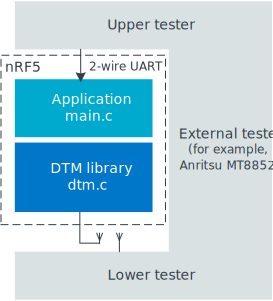

# Get started

The Direct Test Mode app in nRF Connect for Desktop provides a graphical UI for the Direct Test Mode (DTM) commands through 2-wire UART. The DTM is a Bluetooth® test framework used for performing RF PHY testing of Bluetooth Low Energy devices and ensuring interoperability of the Bluetooth devices.

You can use the Direct Test Mode app to control the following features of the radio:

- Set transmission power and receiver sensitivity
- Set frequency offset and drift
- Set modulation characteristics
- Verify packet error rate
- Set intermodulation performance

See the [Bluetooth Core specification](https://www.bluetooth.com/specifications/specs/core-specification-5-3/) (volume 6, part F) for more information about the DTM requirements.

!!! tip "Important"
      The Direct Test Mode app cannot be used as a testing or certification tool. This is because it only provides a graphical wrapper around DTM commands for the Upper Tester. For verification using both the Upper Tester and the Lower Tester, you need an external tester equipment. For example, in case of the [Direct Test Mode Bluetooth sample](https://docs.nordicsemi.com/bundle/ncs-latest/page/nrf/samples/bluetooth/direct_test_mode/README.html), this can be the Anritsu MT8852 or similar, in which case you obtain the following configuration:

      

The Direct Test Mode app is installed and updated using [nRF Connect for Desktop](https://docs.nordicsemi.com/bundle/nrf-connect-desktop/page/index.html) (v4.4.1 or later).

## Installing the Direct Test Mode app

For installation instructions, see [Installing nRF Connect for Desktop apps](https://docs.nordicsemi.com/bundle/nrf-connect-desktop/page/installing_apps.html) in the nRF Connect for Desktop documentation.

## Supported devices

The Direct Test Mode app can be used with devices programmed with firmware compatible with Direct Test Mode:

* You can use one of the devices compatible with the [Direct Test Mode Bluetooth sample](https://docs.nordicsemi.com/bundle/ncs-latest/page/nrf/samples/bluetooth/direct_test_mode/README.html) from the nRF Connect SDK and programmed with this sample. For such devices, the Direct Test Mode app does not provide the required firmware, which might result in an error ("DTM setup reset command failed") if you do not program them beforehand when [using the app](using_dtm.md).

    !!! note "Note"
         The [Direct Test Mode Bluetooth sample](https://docs.nordicsemi.com/bundle/ncs-latest/page/nrf/samples/bluetooth/direct_test_mode/README.html) supports two Device Under Test communication protocols: 2-wire UART and experimental HCI UART interface. The Direct Test Mode app only supports the 2-wire UART.

* You can also use third-party devices that are programmed with the DTM standard protocol and expose access to it through a serial port.

## Application source code

The code of the application is open source and [available on GitHub](https://github.com/NordicSemiconductor/pc-nrfconnect-dtm).
Feel free to fork the repository and clone it for secondary development or feature contributions.