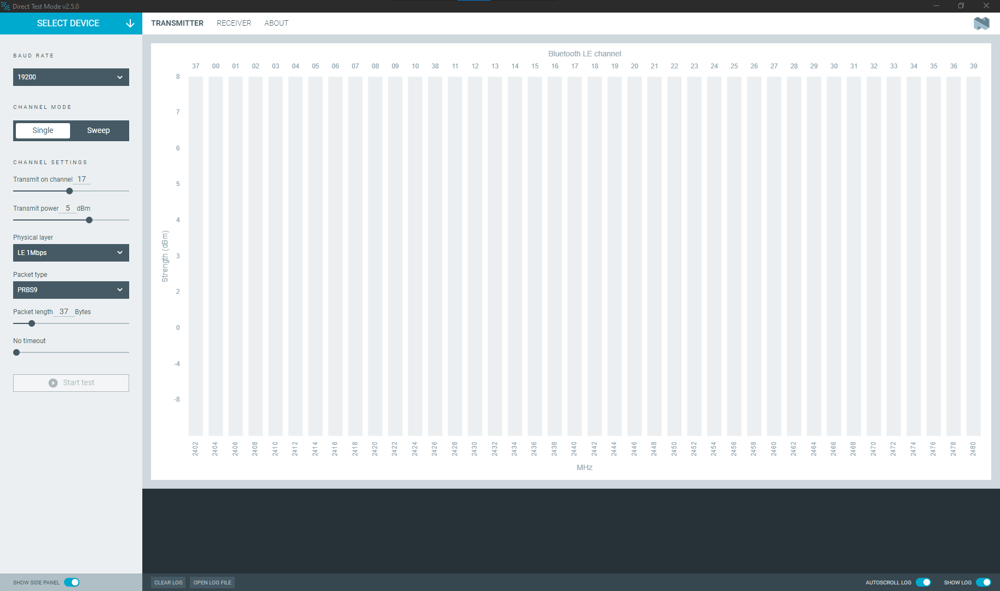
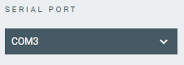

# Overview and user interface

After starting the Direct Test Mode app, the main application window is displayed.

The available options and information change after you **Select Device**.

## Select Device

Once you connect a device to the system, it becomes visible and available when you click on the **Select device** drop-down list. You can choose a device from the list of connected devices to perform further actions on the device.

When you select a device:

* The **Serial port** menu appears, where you can select the port for testing, if you do not want to use the default one.

    

* The **Start test** button becomes available in both the **Transmitter** and **Receiver** tab.

## Baud rate

The **Baud rate** drop-down menu lets you select the baud rate used for the test.

## Transmitter tab

In **Transmitter** tab, you can configure and test the transmission of the Bluetooth packets and verify the fidelity of the transmission.

Click **Start test** to start transmitting test packets.

The available settings are related to the DTM specification.

|       Settings       |       Option        |                                                 Description                                                 |
| -------------------- | ------------------- | ----------------------------------------------------------------------------------------------------------- |
| **Channel mode**     | Single              | Transmit on the specified channel only.                                                                     |
|                      | Sweep               | Transmit in the specified channel range.                                                                    |
| **Channel settings** | Transmit on channel | Channel on which to transmit test packets.                                                                  |
|                      | Transmit power      | Power of the transmission, from -40 dBm to 8 dBm.                                                                                  |
|                      | Transmit period     | Time during which to transmit. Only available for the Sweep mode.                                           |
|                      | Physical layer      | Select the PHY layers on which to transmit test packets.                                                    |
|                      | Packet type         | Select the test pattern for the test packets. `Constant carrier` uses [vendor-specific packet payload](https://docs.nordicsemi.com/bundle/ncs-latest/page/nrf/samples/bluetooth/direct_test_mode/README.html#vendor-specific_packet_payload).                                                               |
|                      | Packet length       | Select the length of the packet.                                                                            |
|                      | Timeout             | Select the duration of time for which the device under test (DUT) waits for a response from another device. |

## Receiver tab

In the **Receiver** tab, you can configure and test the reception of the Bluetooth packets and verify the fidelity of the reception.

Click **Start test** to start receiving test packets.

The available settings are related to the DTM specification.

|       Settings       |       Option       |                                                 Description                                                 |
| -------------------- | ------------------ | ----------------------------------------------------------------------------------------------------------- |
| **Channel mode**     | Single             | Receive on the specified channel only.                                                                      |
|                      | Sweep              | Receive in the specified channel range.                                                                     |
| **Channel settings** | Receive on channel | Channel on which to receive test packets.                                                                   |
|                      | Receive period     | Time during which to receive packets. Only available for the Sweep mode.                                    |
|                      | Physical layer     | Select the PHY layers on which to receive test packets.                                                     |
|                      | Timeout            | Select the duration of time for which the device under test (DUT) waits for a response from another device. |

## Log

The Log panel allows you to view the most important log events, tagged with a timestamp. Each time you open the app, a new session log file is created. You can find the Log panel and its controls, below the main application Window.

- When troubleshooting, to view more detailed information than shown in the Log panel, use **Open log file** to open the current log file in a text editor.
- To clear the information currently displayed in the Log panel, use **Clear Log**. The contents of the log file are not affected.
- To hide or display the Log panel in the user interface, use **Show Log**.
- To freeze Log panel scrolling, use **Autoscroll Log**.

## About tab

You can view application information, restore defaults, access source code and documentation. You also can find information on the selected device, access support tools, send feedback, and enable verbose logging.